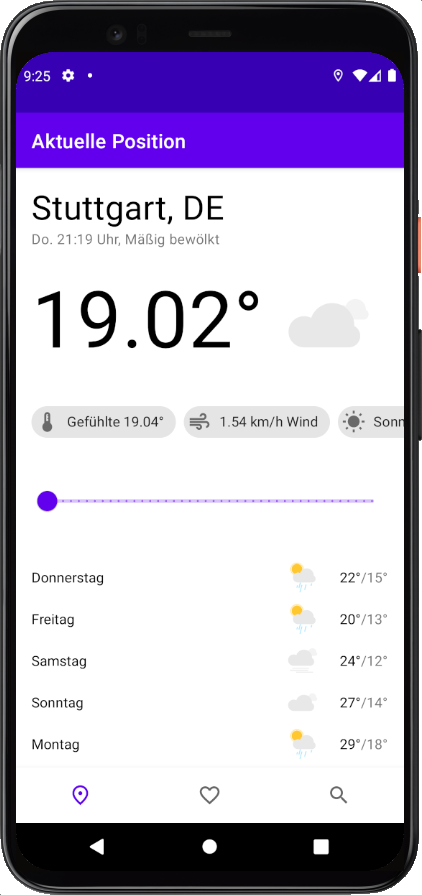
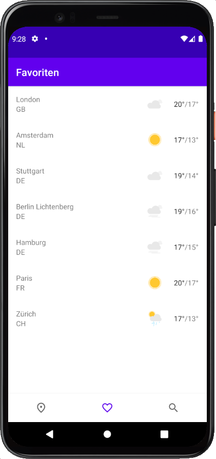
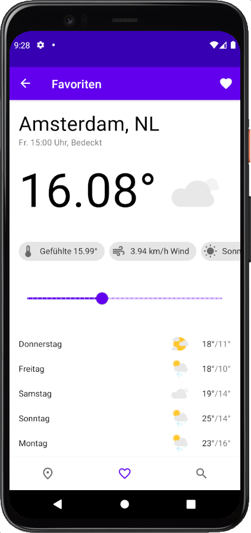

  

# Abstract

The projects goal was to create a app, which enpowers the user to see the latest weather data of his current location. Additionally a search view is implemented so the user can look up his favourit city by simply searching by the name. A search result can be saved and will show up on the faviroutes view for quick access. In order to achieve the goal of providing the current weather data, the app uses the free [OpenWeather API](https://openweathermap.org/). The received informations are stored inside a SQLite database so they can be provided quickly and reliably inside the app. Therefore the [Room](https://developer.android.com/jetpack/androidx/releases/room) library came to use. Besides that we additionally used the Glide library for loading and caching images, the Paging library for showing the cities just in time, filtered by the search input and Retrofit for accessing the API endpoints.

# Libraries

- **AndroidX**: appcompat, recyclerview, constraintlayout, navigation, lifecycle, paging
- **Material**: An libary with implementations of the material design and the according components.
- **Room**: An abstraction layer for interacting with a SQLLite database
- **Glide:** An image loading and caching library for Android focused on smooth scrolling
- **Retrofit**: An type-safe http client for android and java

# Screenshot

  
  
  

Icon made by iconixar from www.flaticon.com
